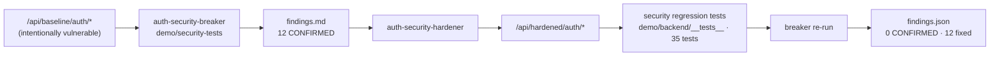

# 🛡️ Auth Security Skills Lab — Day 7

I build full-stack systems, and I keep asking the same question the OWASP cheatsheet can't
answer for you: *is this secure by design, or does it just work?*

This is **Day 7** of the security lab series ([Day 4 — IDOR & Mass Assignment](https://github.com/kashiraza01/idor-lab-checks),
Day 6 — JWT hardening). The subject is **authentication**, and the twist is two custom
Claude Code skills:

- **`auth-security-breaker`** — adversarially audits an auth implementation and produces
  reproducible, evidence-backed findings.
- **`auth-security-hardener`** — reviews auth code against a checklist and implements
  targeted fixes, with a test for each.
- **`auth-security-loop`** — runs the two against each other (break → fix → re-break) until the
  break stops working, with a deterministic referee and a lessons ledger that makes the skills
  sharper each round.

One tries to break your login. The other tries to fix it. The third runs them in a loop until it
holds. I pointed all three at the same MERN auth codebase and let the numbers do the talking.

---

## What's in here

```
skills/
  auth-security-breaker/     adversarial auditor: SKILL.md router + references/ + a ZERO-DEP probe CLI (scripts/)
  auth-security-hardener/    remediator: SKILL.md router + references/ (checklist, remediation patterns, per-framework)
  auth-security-loop/        self-evaluating break->fix->re-break loop with a deterministic referee + a lessons ledger
demo/
  backend/                   ONE Express app, TWO auth stacks:
                               /api/baseline/auth/*   intentionally vulnerable (realistically)
                               /api/hardened/auth/*   skill-hardened
  frontend/                  Next.js 15 comparison UI — real source + a live audit run
  security-tests/            the breaker skill as code — `npm run audit` → docs/findings.json
packages/
  constant-time-auth/        extractable login-timing mitigation (see docs/npm-evaluation.md)
docs/                        architecture · threat-model · findings · hardening · security-testing
```

Both auth stacks run in the **same process** against the **same database**, so the
comparison is honest — same runtime, same data, same request shapes. Only the middleware
and services differ.

---

## Why it exists

A first-draft auth implementation — the kind a developer or an AI assistant hands you —
tends to have the same handful of problems. This lab makes them concrete and measurable:

| Problem | What the baseline does | What it costs you |
|---|---|---|
| **Timing enumeration** | unknown email → return before the hash; known email → run bcrypt | response time tells an attacker which emails are registered |
| **Trusting the token** | authorization reads the `role` claim from the JWT | register with `{"role":"admin"}` and you're an admin |
| **Weak token design** | 7-day access token, no algorithm pin, secret falls back to `"dev-secret"` | anyone who reads the source forges an admin token |
| **No brute-force protection** | login answers as fast as you can call it | unlimited online password guessing |
| **Broken logout** | logout clears the client cookie, nothing server-side | a stolen token is valid for a week regardless |

The hardened stack fixes each one, and the audit proves it — 12 CONFIRMED findings on the
baseline, 0 on the hardened stack, from the same probes.

---

## Architecture



More detail — component diagram, data model, the auditor internals — in
[`docs/architecture.md`](docs/architecture.md).

---

## Run it

**Prerequisites:** Node 20+ (built and tested on 24). No database needed — an in-memory
MongoDB boots automatically. Docker is optional (`docker compose up -d` for a persistent
Mongo).

```bash
git clone https://github.com/kashiraza01/auth-security-skill
cd auth-security-skill
npm install
npm run generate:secrets     # fills the HARDENED_* JWT secrets in demo/backend/.env
```

> The first `npm install` will ask you to approve install scripts for `esbuild` and
> `mongodb-memory-server` — both are expected (`npm install-scripts approve esbuild
> mongodb-memory-server`). The first test/audit run downloads a ~130 MB mongod binary once.

### The comparison UI

```bash
npm run dev
```

- API → http://localhost:4000
- UI → **http://localhost:3000/lab**

Pick a check on the left. The centre shows the real source on each side ("Without Security
Skill" / "With Security Skill"). Hit **run audit** — it spawns the real auditor against both
stacks and streams the output; every number you then see (timing medians, effect sizes,
status codes) comes from that run.

### The audit on its own

```bash
npm run audit
```

Spawns its own backend if none is running, audits both stacks, writes
[`docs/findings.json`](docs/findings.md), and prints a table with a "FIXED BY HARDENING"
diff. Scope-guarded to `localhost` — see [Responsible use](#responsible-use).

### The tests

```bash
npm test                                        # backend (35) + package (10) + skill structural (24)
npm run bench -w @auth-lab/constant-time-auth    # the timing-mitigation benchmark
```

---

## The walkthrough

```
baseline stack
      ↓  auth-security-breaker  (demo/security-tests)
12 CONFIRMED findings  (docs/findings.md)
      ↓  auth-security-hardener
hardened stack  (paired controllers, same contracts)
      ↓  security regression tests  (35, jest + supertest)
      ↓  breaker re-run
0 CONFIRMED  ·  12 fixed  (docs/hardening.md)
```

### The one worth seeing — login timing

**Before** (`demo/backend/src/controllers/baseline.auth.controller.ts`):

```ts
const user = await User.findOne({ email });
if (!user) {
  return res.status(401).json({ error: "No account found with that email address" });
}
const ok = await baselineCompare(String(password ?? ""), user.passwordHash);   // bcrypt — ~25 ms
if (!ok) {
  return res.status(401).json({ error: "Incorrect password" });
}
```

The `if (!user) return` fires before the hash. Measured over 60 samples per group on
loopback:

| cohort | median | p95 |
|---|---|---|
| unknown account | **18.5 ms** | 20.1 ms |
| known account, wrong password | **38.3 ms** | 42.4 ms |

Median delta **19.9 ms** · Cliff's delta **1.00** (complete separation) · Mann-Whitney
**p ≈ 0**. The response time is an oracle for "is this email registered".

**After** (`hardened.auth.controller.ts`):

```ts
const user = await User.findOne({ email });
const hashToCheck = user ? user.passwordHash : await getDummyArgon2Hash();   // always one verify
const passwordOk = await hardenedVerify(hashToCheck, password);
if (!user || !passwordOk) {
  recordFailure(email);
  throw new HttpError(401, "Invalid email or password");                     // one generic error
}
```

Same probe: median delta **0.7 ms**, Cliff's delta **0.09**, p **0.41** → NOT_DETECTED.

It is **not a `sleep()`** — that doesn't equalise the distributions and is removable with
enough samples. It's constant *work*: one hash verification either way. And it's not
absolute — the user lookup and hash variance still differ by sub-millisecond amounts. See
[`docs/hardening.md`](docs/hardening.md) #1 and
[`packages/constant-time-auth`](packages/constant-time-auth/README.md).

---

## The skills

All three follow the same shape: a lean `SKILL.md` router, depth in `references/` loaded on
demand, and — for the breaker — a **zero-dependency probe CLI** (`scripts/`) that audits **any**
auth API described by a JSON target profile, not just this demo. Each skill folder is
self-contained: `cp -r` it into `~/.claude/skills/` and it runs with nothing else installed.

### `auth-security-breaker`

Maps the auth attack surface, reads the code, builds one safe probe per hypothesis, runs
them low-volume and sequential, and classifies each result
**CONFIRMED / SUSPECTED / INFORMATIONAL / NOT_DETECTED** — with the numbers, never
adjectives. Timing analysis uses repeated measurement, medians, Cliff's delta (effect size)
and Mann-Whitney U (non-parametric significance), and every timing finding carries a
limitations line. It **never** claims a timing difference is "exploitable" without saying
what that would take. → [`skills/auth-security-breaker/SKILL.md`](skills/auth-security-breaker/SKILL.md)

### `auth-security-hardener`

Reviews against the checklist, explains why each issue matters with a concrete attack, then
decides **FIX / RECOMMEND / SKIP** per item — inspecting the actual architecture first, not
applying a template. FIX items are implemented in place, smallest change that keeps the
contract, one concern per change, a security test for each. Nothing is described as "now
secure"; every fix states its residual risk. → [`skills/auth-security-hardener/SKILL.md`](skills/auth-security-hardener/SKILL.md)

### Install into your own project

Each skill folder is self-contained (its own `scripts/`, `references/`, and a seeded lessons
ledger) — you can install one on its own, or all three. Node 20+; no `npm install`.

```bash
# just the auditor (read-only, safest to start with):
cp -r skills/auth-security-breaker  ~/.claude/skills/

# add the remediator, and the loop (which needs both skills + its two subagents):
cp -r skills/auth-security-hardener ~/.claude/skills/
cp -r skills/auth-security-loop     ~/.claude/skills/
cp -r .claude/agents/auth-*.md      ~/.claude/agents/
```

Then point the breaker at any API — copy `scripts/profiles/example-generic.json`, fill in your
endpoints, and run `node scripts/audit.mjs --profile=mine.json` (writes `findings.json` in the
current directory).

**What each skill can touch — know this before you hand it your repo:**

| Skill | What it does to your machine |
|---|---|
| `auth-security-breaker` | **Read-only-ish.** Reads your code; makes low-volume HTTP requests to a **localhost / allowlisted** target only (refuses production). No file edits. |
| `auth-security-hardener` | **Edits code.** Modifies your auth source and adds tests to close findings. Review its diff like any PR. |
| `auth-security-loop` | Runs the two above in a loop — so it both edits code and runs your server / shell locally. |

These are exercised against the bundled demo. Against a real third-party stack they'll attempt
the same methodology, but treat the first run as an assessment to review, not a rubber stamp.

---

## Threat model — in brief

**Defends against** (in the hardened stack): user enumeration (timing, message,
registration, operator-injection), online password guessing, token forgery, privilege
escalation via a claim, token-valid-after-logout, token-valid-after-password-change,
refresh-token replay, XSS session theft, cross-site credentialed requests, recon via error
bodies, credentials in logs.

**Does not cover:** XSS/CSRF as their own topics, network attacks and TLS config,
secrets/infrastructure compromise, distributed high-volume attacks, timing to the
theoretical limit, account recovery / password reset, MFA, and denial of service (including
the DoS-against-one-account that per-account lockout introduces).

Full version: [`docs/threat-model.md`](docs/threat-model.md).

---

## Responsible use

This is an **educational security lab**. The `auth-security-breaker` skill and
`demo/security-tests` are for **systems you own or are explicitly authorised to test**. They
default to `localhost` / `127.0.0.1` / `::1`, refuse `NODE_ENV=production`, refuse a target
described as production, require an explicit `AUTH_LAB_ALLOW_TARGET` allowlist entry for
anything else, run low-volume and sequential, and perform no destructive actions and no
persistence. Do not point them at infrastructure you don't control.

The `demo/backend/src/controllers/baseline.*` code is **intentionally vulnerable** and
labelled as such in every file. Don't copy it into anything real.

---

## Connect

I bridge development and security — building systems where scalability *and* resistance to
attack are the requirement, not an afterthought.

🔗 [Kashif Raza on LinkedIn](https://www.linkedin.com/in/kashif-raza-se)

## Licence

MIT — see [LICENSE](LICENSE).
