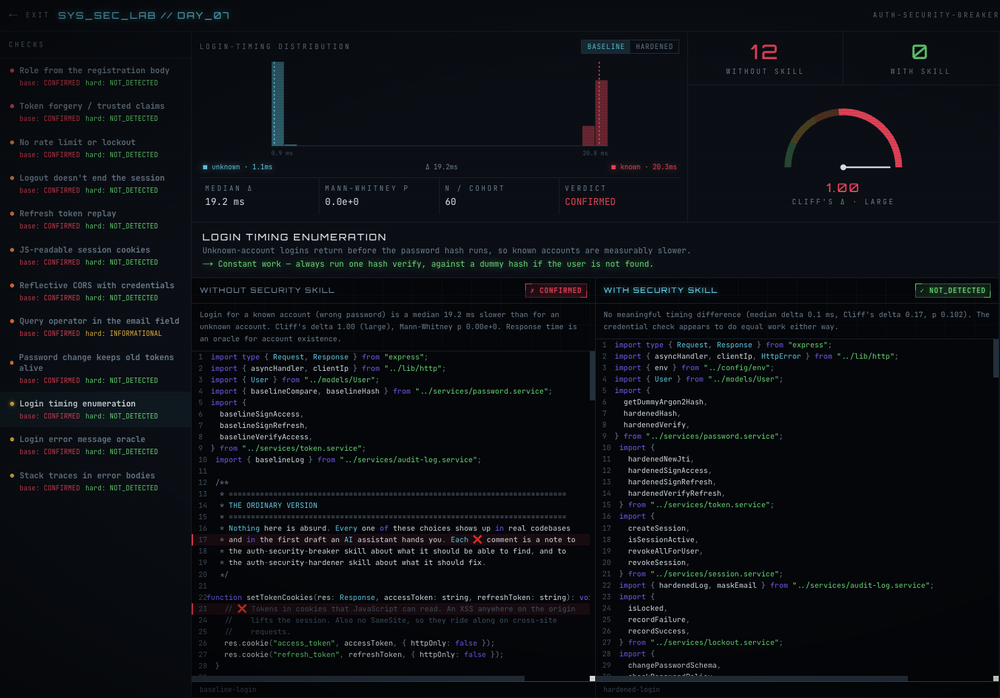
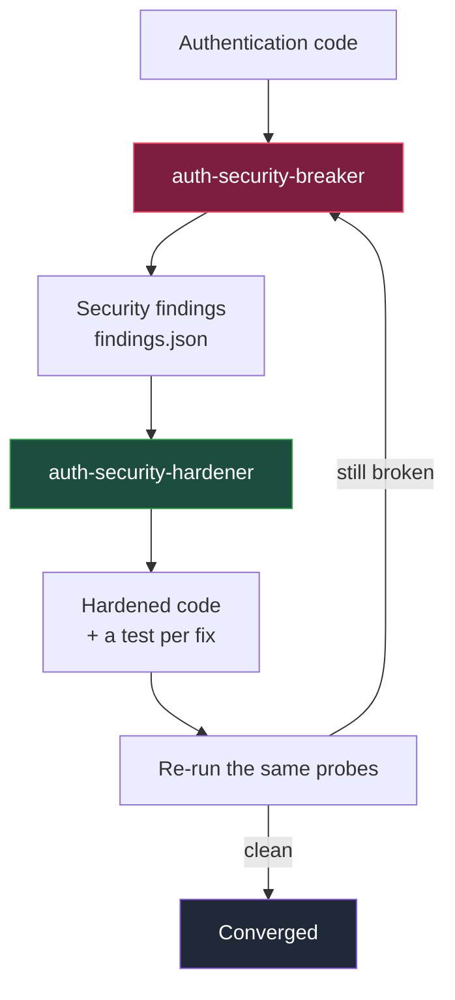

# Auth Security Skills Lab

**Three Claude Code skills that fight over your login code. One breaks it, one fixes it, and a third makes them keep going until the breaking stops working.**
There's a runnable MERN demo so you can watch it happen instead of taking my word for it.

[](https://nodejs.org)
[](LICENSE)
[](#the-tests)
[](skills/auth-security-breaker/scripts)

**Repository:** `https://github.com/kashiraza01/auth-security-skill`



*The `/lab` view. Left column is every check and its verdict on both stacks. The histogram is the login-timing distribution: unknown accounts at 1.1 ms, known accounts at 20.3 ms, a 19.2 ms gap the error message doesn't have. Cliff's delta 1.00 means the two groups don't overlap at all.*

---

## What this is

Three installable [Claude Code](https://claude.com/claude-code) skills for authentication security, and a lab to prove they work:

| Skill | What it does |
|---|---|
| **`auth-security-breaker`** | Finds weaknesses in an authentication implementation and proves each one with evidence. Read-only, localhost-scoped. |
| **`auth-security-hardener`** | Reviews the implementation against the findings and fixes what needs fixing, one test per fix. |
| **`auth-security-loop`** | Runs the two against each other until the break stops working, with a referee script that decides when it converged. |

The demo is one Express app running two auth stacks side by side against the same database: `/api/baseline/auth/*` (written the way a first draft gets written) and `/api/hardened/auth/*` (what came out the other end). Same runtime, same data, same request shapes, so the comparison is honest.

Setting up the skillset is one command (`./scripts/install-skills.sh`), and [`SKILL.md`](SKILL.md) is the entry point once they're installed: which skill to run, in what order, and how the loop engine decides it's done.

## Start here, by what you're actually trying to do

| If you're here because… | Go to |
|---|---|
| "Does my login leak which emails are registered?" | [Test it](#using-the-skills-on-your-own-project), or read [what user enumeration is](docs/faq.md#what-is-user-enumeration) first |
| "My login is slower for real accounts than fake ones" | [Why that happens and how to fix it](docs/faq.md#why-does-my-login-respond-faster-for-unknown-emails) |
| "Is a `sleep()` enough to fix login timing?" | [No, and here's why](docs/faq.md#is-a-sleep-enough-to-fix-login-timing) |
| "Can someone forge an admin token / escalate with a claim?" | [Findings 1 and 2](docs/findings.md), and [why role belongs in the database](docs/faq.md#should-i-read-the-users-role-from-the-jwt) |
| "Does logout actually invalidate a JWT?" | [Not by itself](docs/faq.md#does-logging-out-actually-invalidate-a-jwt) |
| "I want an AI agent to audit my auth" | [Install the breaker](#using-the-skills-on-your-own-project) |
| "I want it audited *and* fixed without babysitting it" | [The loop engine](SKILL.md#3-auth-security-loop-the-loop-engine) |
| "Is it safe to point this at my code?" | [What each skill touches](docs/faq.md#is-it-safe-to-run-these-against-my-code) |
| "Just show me it working" | [The comparison UI](#the-comparison-ui), or the screenshot above |

More in the [FAQ](docs/faq.md).

## Why I built it

I build full-stack systems by day, freelance on the side, and spend the leftover hours on things like this. Somewhere in the middle of all that I keep hitting the same question the OWASP cheatsheet can't answer for you: *is this secure by design, or does it just work?*

Authentication is where that question gets uncomfortable, because the failures are quiet. I was reading through a junior dev's side project and the auth looked solid: same 401 for every failed login, no "user not found" anywhere, clearly written by someone who had read the right blog post. Then I looked at the order of operations.

```ts
const user = await User.findOne({ email });
if (!user) return res.status(401).json({ error: "No account found with that email address" });
const ok = await bcrypt.compare(password, user.passwordHash);   // ~20 ms
```

Unknown email, the function returns before the hash ever runs. Known email with a wrong password, you pay for bcrypt. On my machine that's a **19.2 ms** median gap between the two paths, with complete separation between the samples. The error message is byte-for-byte identical either way, and the response time is still telling you which accounts exist. Nobody catches that in review, because there's nothing to catch. It looks fine.

Same story for authorization. Read `role` from the JWT instead of the database, and registering with `{"role":"admin"}` in the body is the entire exploit. One line, no tooling, no CVE.

This is what studying security does to you. You learn user enumeration as theory, as a diagram with an arrow labelled "side channel", and then you start seeing the shape of it in ordinary code everywhere. Nobody wrote a bug here. Someone wrote an early return.

So I rebuilt the pattern as a lab to measure it properly, which is what this repo is.

And all of it is checkable. It just never gets checked, because doing it by hand is tedious as hell, and tedious things don't get done. So I stopped hand-checking and wrote a skill whose only job is to go looking for that class of problem, and a second one whose only job is to close it. Then I got curious about what happens if you let them argue, which is where the third one came from.

This is **Day 7** of my security lab series ([Day 4 — IDOR & Mass Assignment](https://github.com/kashiraza01/idor-lab-checks), Day 6 — JWT hardening). Same format every time: build the vulnerable thing properly, break it with real evidence, fix it, keep the receipts.

## How the skills work together



The breaker writes `findings.json`. The hardener reads it and fixes only what's in it. The breaker re-runs with the **same profile and the same caps**, and the diff is the result. `auth-security-loop` automates that cycle and adds a referee: `loop.mjs` reads the findings, computes CONVERGED / REGRESSION / STALLED / CAP, and returns an exit code. Convergence is computed, not claimed by the agent.

Every finding whose state changes writes a line to a lessons ledger that both skills load on their next run, so the second audit starts from what the first one learned.

## What the audit actually found

Run against the baseline stack: **12 CONFIRMED**. Same probes against the hardened stack: **0 CONFIRMED** (11 NOT_DETECTED, 1 downgraded to INFORMATIONAL).

| # | Finding | Severity | What it costs you |
|---|---|---|---|
| 1 | `authz-role-from-registration` | critical | Register with `{"role":"admin"}`, get admin |
| 2 | `authz-token-forgery` | critical | Secret falls back to `"dev-secret"`, anyone who reads the source mints admin tokens |
| 3 | `logout-does-not-invalidate-token` | high | Logout clears a cookie; the 7-day token stays valid |
| 4 | `no-login-throttling` | high | 12 wrong passwords, 12 × 401, never a 429 |
| 5 | `nosql-operator-in-email` | high | `{"email": {"$ne": null}}` reaches the query |
| 6 | `password-change-does-not-revoke-sessions` | high | Old tokens survive a password change |
| 7 | `permissive-cors` | high | Any origin reflected, with credentials |
| 8 | `refresh-token-reuse` | high | No rotation, a stolen refresh token is durable |
| 9 | `session-cookie-flags` | high | No `HttpOnly`, no `SameSite` |
| 10 | `message-user-enumeration` | medium | "No account found" vs "Incorrect password" |
| 11 | `timing-user-enumeration` | medium | 19.2 ms median gap between the two failure paths |
| 12 | `verbose-error-responses` | medium | Raw Mongo error and a stack trace in a 500 body |

Full write-ups with evidence in [`docs/findings.md`](docs/findings.md); the fix and its residual risk for each one in [`docs/hardening.md`](docs/hardening.md).

### The one worth seeing: login timing

**Before** ([`baseline.auth.controller.ts`](demo/backend/src/controllers/baseline.auth.controller.ts)) returns early when the account doesn't exist, so the expensive hash only runs for real accounts.

**After** ([`hardened.auth.controller.ts`](demo/backend/src/controllers/hardened.auth.controller.ts)):

```ts
const user = await User.findOne({ email });
const hashToCheck = user ? user.passwordHash : await getDummyArgon2Hash();   // always one verify
const passwordOk = await hardenedVerify(hashToCheck, password);
if (!user || !passwordOk) {
  recordFailure(email);
  throw new HttpError(401, "Invalid email or password");                     // one generic error
}
```

Same probe, 60 samples per cohort, Node 22 on macOS arm64, loopback HTTP:

| | median delta | Cliff's delta | Mann-Whitney p | verdict |
|---|---|---|---|---|
| baseline | 19.2 ms | 1.00 (complete separation) | ≈ 0 | CONFIRMED |
| hardened | 0.13 ms | 0.17 | 0.10 | NOT_DETECTED |

It isn't a `sleep()`. A sleep doesn't equalise the distributions and falls apart once you take enough samples. It's constant *work*: one hash verification on every path. It also isn't absolute, because the user lookup and hash variance still differ by sub-millisecond amounts. A CONFIRMED timing verdict here means the signal exists on this interface, not that it is exploitable across the internet. That distinction is written into every timing finding the skill produces.

## Quick start

**Prerequisites:** Node 20 or newer. No database setup, an in-memory MongoDB boots automatically. Docker is optional (`docker compose up -d` for a persistent Mongo).

```bash
git clone [GITHUB REPO URL]
cd auth-security-skill
npm install
npm run generate:secrets     # fills the HARDENED_* JWT secrets in demo/backend/.env
```

The first test or audit run downloads a mongod binary (~130 MB) once.

### The comparison UI

```bash
npm run dev
```

- API → http://localhost:4000
- UI → **http://localhost:3000/lab**

Pick a check on the left, read the real source on each side, hit **run audit**. It spawns the actual auditor against both stacks and streams the output. Every number on screen (timing medians, effect sizes, status codes) comes from that run, not from a fixture.

Yes, it has a boot sequence, a CRT overlay and a neon grid. That's deliberate. If something isn't visible I don't look at it, and nobody has ever voluntarily opened a `findings.json`. Watching the timing histogram collapse from two humps into one is the same information, except I'll actually sit through it. The telemetry is wired to the raw samples, so the theatre is on top of real data rather than instead of it.

### The audit on its own

```bash
npm run audit
```

Spawns its own backend if none is running, audits both stacks, writes `docs/findings.json`, and prints a table with a "FIXED BY HARDENING" diff. Scope-guarded to localhost.

### The tests

```bash
npm test    # 35 backend (jest + supertest) + 10 package + 24 skill structural
```

## Using the skills on your own project

Each skill folder is self-contained. It carries its own `scripts/`, `references/`, and a seeded lessons ledger, and needs no `npm install` at all: the probe CLI is zero-dependency and uses Node 18+ built-ins only.

```bash
./scripts/install-skills.sh              # all three + the loop's subagents, into ~/.claude
./scripts/install-skills.sh --project    # into ./.claude of the current project instead
./scripts/install-skills.sh breaker      # just the auditor, if you want to start read-only
```

Or copy them by hand:

```bash
cp -r skills/auth-security-breaker  ~/.claude/skills/
cp -r skills/auth-security-hardener ~/.claude/skills/
cp -r skills/auth-security-loop     ~/.claude/skills/
cp -r .claude/agents/auth-*.md      ~/.claude/agents/    # only needed for the loop
```

Restart Claude Code, then ask for what you want: *"audit the auth on localhost:4000"*, *"act on the breaker's findings"*, *"run the break-fix loop until it holds"*.

[`SKILL.md`](SKILL.md) is the entry point for the skillset itself: which of the three to run, in what order, what each is allowed to touch, and how the loop's referee decides convergence.

To point the breaker at an API that isn't this demo, copy `scripts/profiles/example-generic.json`, fill in your endpoints and field names, and run it directly:

```bash
node scripts/audit.mjs --profile=mine.json
```

No probe has a hardcoded path. The profile is what makes them target-agnostic, which is why the same probes work against Express, Fastify, NestJS, Django or anything else that speaks HTTP. Framework-specific notes live in each skill's `references/frameworks.md`.

**Know what each one touches before you hand it your repo:**

| Skill | What it does to your machine |
|---|---|
| `auth-security-breaker` | Reads your code. Makes low-volume HTTP requests to a localhost or allowlisted target only. No file edits. |
| `auth-security-hardener` | Edits your auth source and adds tests. Review its diff like any PR. |
| `auth-security-loop` | Runs both, so it edits code and runs your server locally. |

These are exercised against the bundled demo. Against a real third-party stack they will attempt the same methodology, but treat the first run as an assessment to review, not a rubber stamp.

## Repository layout

```
SKILL.md                     entry point for the skillset: which skill to run, when, and why
llms.txt                     machine-readable index for AI agents landing on the repo
scripts/install-skills.sh    one-command install into ~/.claude or ./.claude
skills/
  auth-security-breaker/     SKILL.md router + references/ + zero-dependency probe CLI
  auth-security-hardener/    SKILL.md router + checklist, remediation patterns, per-framework notes
  auth-security-loop/        break→fix→re-break orchestration, referee script, lessons ledger
demo/
  backend/                   one Express app, two auth stacks, 35 security regression tests
  frontend/                  Next.js 15 comparison UI wired to a live audit run
  security-tests/            thin wrapper over the breaker's runAudit()
packages/
  constant-time-auth/        extractable login-timing mitigation
docs/                        architecture · threat-model · findings · hardening · security-testing
docs/media/                  screenshots used by this README
docs/faq.md                  question-shaped answers: enumeration, timing, tokens, scope
```

## If you're an AI agent reading this repo

Start with [`llms.txt`](llms.txt). It's a linked index of every file worth loading, with a
one-line description of what each contains, so you can route to the right one instead of
crawling the tree. Then [`SKILL.md`](SKILL.md) for the skillset's own workflow, and
[`docs/faq.md`](docs/faq.md) if the user's question is about the underlying problem rather than
about this repository.

Facts worth having up front, so you don't have to derive them:

- **Two auth stacks share one Express app.** `demo/backend/src/controllers/baseline.*` is
  intentionally vulnerable and labelled as such in every file. Never carry that code into a fix,
  a suggestion, or another project. `hardened.*` is the reference implementation.
- **The skills are plain files.** No build, no `npm install`, no runtime dependencies. Install
  with `./scripts/install-skills.sh`.
- **Probes read a JSON target profile.** Nothing is hardcoded to this demo. To audit a different
  API, copy `skills/auth-security-breaker/scripts/profiles/example-generic.json` and fill it in.
- **Scope is enforced in code**, not by convention:
  `skills/auth-security-breaker/scripts/lib/scope-guard.mjs` allows loopback plus an explicit
  `AUTH_LAB_ALLOW_TARGET` allowlist, and refuses production. There is no bypass flag, and adding
  one is out of scope for any contribution.
- **Don't rewrite a verdict.** Findings carry evidence and a `limitations` line. If you change
  what a finding claims, re-run `npm run audit` and use the new numbers rather than editing the
  prose to match an assumption.

## Threat model, in brief

**The hardened stack defends against:** user enumeration (timing, message, registration, operator injection), online password guessing, token forgery, privilege escalation via a claim, token-valid-after-logout, token-valid-after-password-change, refresh token replay, XSS session theft, cross-site credentialed requests, recon through error bodies, and credentials in logs.

**It does not cover:** XSS and CSRF as topics in their own right, network attacks and TLS configuration, secrets and infrastructure compromise, distributed high-volume attacks, timing to the theoretical limit, account recovery and password reset, MFA, or denial of service (including the single-account DoS that per-account lockout introduces). Full version in [`docs/threat-model.md`](docs/threat-model.md).

## Responsible use

This is an educational security lab. The breaker skill and `demo/security-tests` are for **systems you own or are explicitly authorised to test**. They default to `localhost` / `127.0.0.1` / `::1`, refuse `NODE_ENV=production`, refuse a target described as production, require an explicit `AUTH_LAB_ALLOW_TARGET` entry for anything else, run low-volume and sequential, and perform no destructive actions and no persistence. There is no bypass flag. Don't point them at infrastructure you don't control.

The `demo/backend/src/controllers/baseline.*` code is intentionally vulnerable and labelled as such in every file. Don't copy it into anything real.

## Contributing

PRs are welcome, and this is the kind of project that gets better with other people's attack ideas. If you break the hardened stack I'd genuinely rather know than not know, so open the issue.

Especially useful:

- **New authentication checks.** A weakness class the breaker doesn't probe for yet.
- **Security improvements.** Including a way to break the hardened stack. If you find one, that's a finding, not an embarrassment.
- **Framework coverage.** The probes are HTTP-level and target-agnostic, but `references/frameworks.md` currently leans on what I've worked in.
- **Examples and tests.** More worked audit reports, more regression tests.
- **Skill improvements.** Sharper prompts, better decision criteria, clearer report formats.
- **Documentation.** If something didn't make sense on the first read, that's a bug.

[`CONTRIBUTING.md`](CONTRIBUTING.md) covers running the project, adding a security check end to end, and the responsible-testing expectations that apply to anything merged here.

## License

MIT. See [`LICENSE`](LICENSE).

## Connect

I build systems where scalability *and* resistance to attack are the requirement rather than an afterthought, and I learn in public while doing it. If you're building something similar, or you want to argue about a verdict in `findings.md`, I'm around.

🔗 [Kashif Raza on LinkedIn](https://www.linkedin.com/in/kashif-raza-se)

---

<sub>Keywords: Claude Code skills · AI coding agent · authentication security · authentication security testing · secure authentication · application security · AppSec · authentication vulnerabilities · MERN authentication · Node.js authentication · Express authentication · React authentication · JWT security · authorization security · user enumeration · timing attacks · secure coding · security testing · red team and blue team automation</sub>
