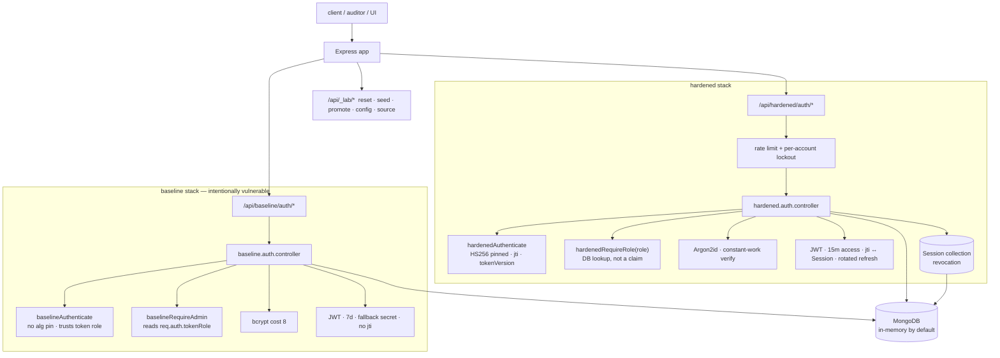
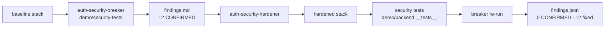

# Architecture

## Repository

```
auth-security-skill/
├── skills/
│   ├── auth-security-breaker/     SKILL.md + README + examples + tests
│   └── auth-security-hardener/    SKILL.md + README + examples + tests
├── demo/
│   ├── backend/                   Express + TS + Mongoose  (one app, two stacks)
│   ├── frontend/                  Next.js 15 comparison UI
│   └── security-tests/            standalone adversarial auditor → docs/findings.json
├── packages/
│   └── constant-time-auth/        extractable timing-equalisation module
└── docs/                          architecture · threat-model · findings · hardening · security-testing · npm-evaluation
```

## The demo backend — one app, two stacks



Both route trees are mounted in the **same process** against the **same `User` collection**.
The only differences are the middleware and services each controller calls. This mirrors the
`idor-lab-checks` pattern (paired vulnerable/secure routes) and keeps the comparison honest —
same runtime, same data, same request shapes.

`MONGO_URI` unset → an ephemeral in-memory MongoDB boots automatically (zero setup). Set it
(e.g. to the bundled `docker-compose` Mongo) for persistence.

## The audit flow



## The auditor (`demo/security-tests/`)

```
run.ts ── parse args, scope-guard the target, spawn the backend if none is running
  │
  ├── buildContext(stack)  reset → seed/register fixtures → read /_lab/config
  │
  └── for each probe:
        harness/http.ts    timed fetch wrapper
        harness/stats.ts   median · p95 · Mann-Whitney U · Cliff's delta
        probes/
          timing-enumeration   interleaved samples, warm-up discard, effect size
          user-enumeration     status/message/shape diff + NoSQL operator input
          authz-escalation     role-from-register · token re-sign · unsigned tamper
          bruteforce-ratelimit ≤12 sequential attempts, single IP
          token-session        logout · password change · logout-all · refresh reuse
          info-leak            error verbosity · cookie flags · CORS reflection
  │
  └── report.ts  → docs/findings.json + console table + "FIXED BY HARDENING" diff
```

`harness/scope-guard.ts` refuses any target that is not loopback or on an explicit
`AUTH_LAB_ALLOW_TARGET` allowlist, and refuses `NODE_ENV=production`.

## The comparison UI (`demo/frontend/`)

Next.js 15 App Router. `/lab` renders the "Without Security Skill / With Security Skill" split
for each check: real source (served read-only from `/api/_lab/source`), the finding for each
side, and a terminal panel that streams a **live** audit run — every number on screen comes
from an executed probe, never a constant.

## Data model

| collection | used by | purpose |
|---|---|---|
| `users` | both | `email`, `passwordHash`, `hashAlgo`, `role`, `permissions`, `tokenVersion`, `createdVia` |
| `sessions` | hardened only | `userId`, `jti`, `status`, `expiresAt`, `revokedReason` — the revocation list |

Per-account lockout state (`lockout.service.ts`) is in-memory by design — see
`hardening.md` RECOMMEND #1.
